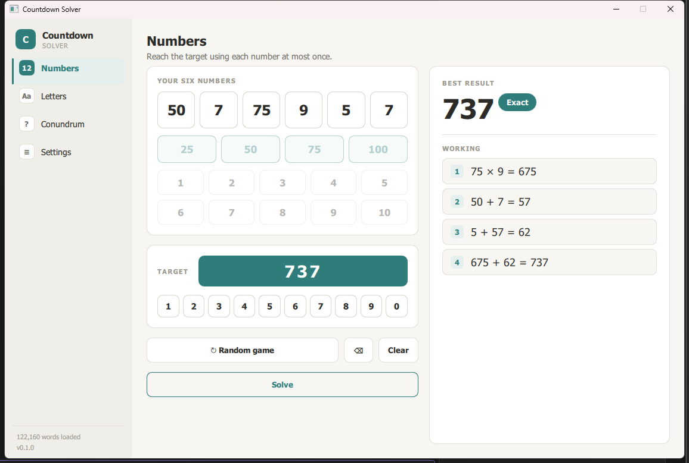
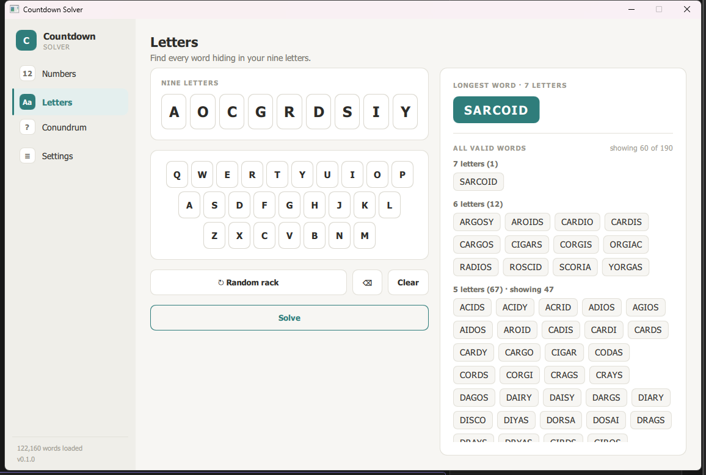
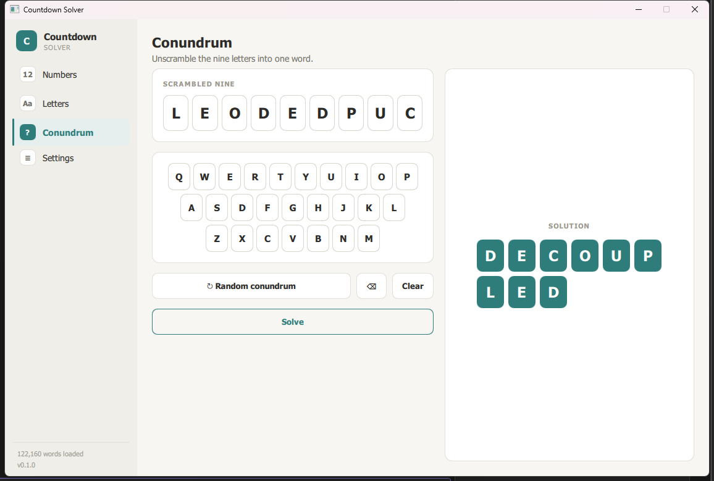
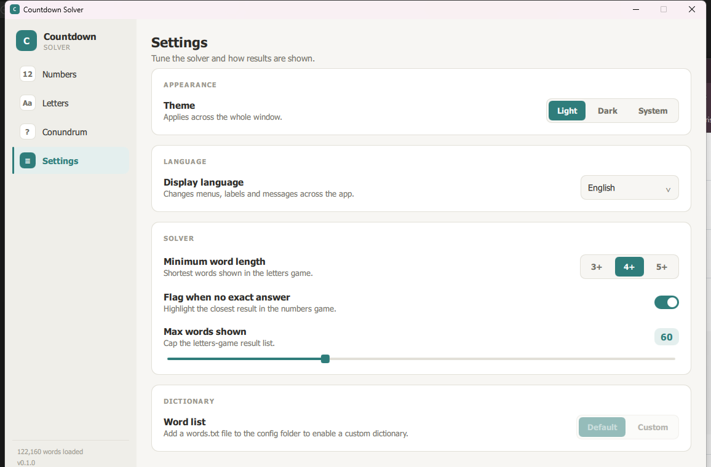
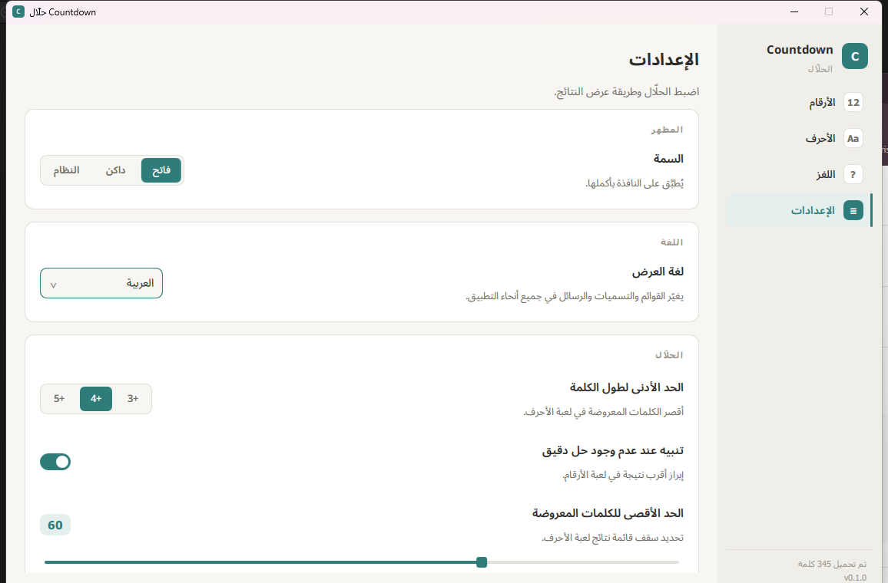

# How to play

CountdownSolver has one screen per round, picked from the sidebar, plus a
Settings screen. This page walks through each one: what to enter and how
to read the result.

## Numbers

1. Fill the six selection tiles from the number pads: the accent-coloured
   pad (25, 50, 75, 100) for the "large" numbers, and 1–10 for the
   "small" ones — pick any mix, same as on the show.
2. Enter a target between 100 and 999 on the keypad.
3. The result card shows:
   - The best value the solver reached, in large type.
   - A badge next to it — filled accent if it's an **exact** match, or
     "N away" if not (only shown when *flag inexact* is on in Settings;
     otherwise it's shown quietly either way).
   - Numbered **working steps**, one calculation per line (e.g.
     `75 × 6 = 450`), building up to the final value. Each number from the
     six tiles is used at most once, and every intermediate result stays a
     positive whole number — same constraints as the TV show.

If a tile or the target is still empty, the card prompts you for what's
missing instead of showing a result.

## Letters

1. Fill the nine letter tiles using the on-screen keyboard (or your
   keyboard) — any mix of vowels and consonants, same as the show.
2. The result card shows:
   - The **longest word(s)** found, as accent-coloured chips — there can
     be more than one if several words tie for longest.
   - Every other valid word, grouped by length (longest first) as outline
     chips, with a "showing X of Y" count if the list is capped (see
     *max results* in Settings below).

## Conundrum

1. Nine scrambled letters are shown as tiles — use the `↻` button to
   generate a new one, or type your own nine letters.
2. Reveal the solution: a 3-column grid of accent tiles spells out the
   single word that uses all nine letters. Any other valid nine-letter
   answers are listed below it.

## Settings

- **Appearance** — light, dark, or system (follows your OS setting).
- **Solver** — minimum word length for Letters results, whether to flag
  inexact Numbers results with the "N away" badge, and a max-results
  slider to cap how many Letters words are shown.
- **Dictionary** — switch between the bundled sample word list and the
  full ~122k-word dictionary. To use your own word list entirely, see
  [Using your own word list](getting-started.md#using-your-own-word-list).

## Languages

Settings also has a language picker: **English**, plus **French, German,
Spanish, Arabic, Hebrew, and Yiddish** — including right-to-left layout
for Arabic and Hebrew, shown here with the display language set to
Arabic:

Switching the display language changes both the UI chrome (menus, buttons,
Settings itself) and gameplay: the Letters and Conundrum rounds solve
against that language's own dictionary and alphabet rules (e.g. French
draws a 10-letter rack instead of 9; German keeps *ä/ö/ü* distinct from
*a/o/u*), not just the on-screen labels. The Numbers game is
language-independent — it's arithmetic, not words.
